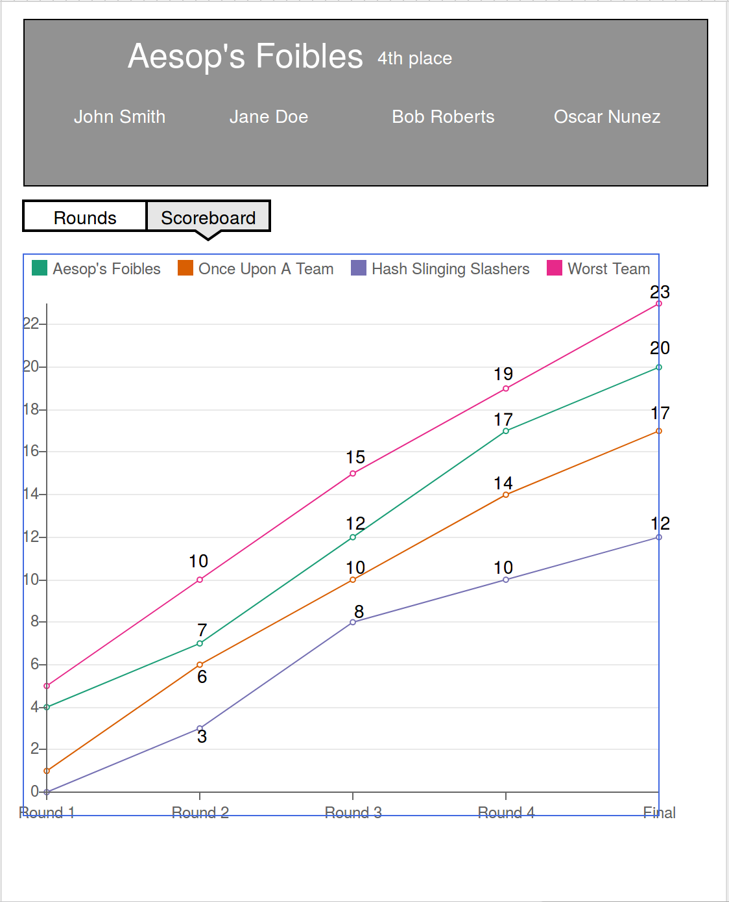

# Trivia App
Unamed trivia app using https://opentdb.com/api_config.php API

## Features
The purpose of this app is to provide a web portal to trivia hosts with tools for managing the trivia session. Features are listed below:

1. Host create a session. They select... 
    1. The number of rounds. 
    2. The number of questions per round.
    3. The types of questions: how many text answer questions vs multiple choice or T/F etc.
    4. The genre(s) of trivia questions.
    5. All questions are pulled from the API and the host can request new questions for entire round(s) or for individual question number.
2. Once the host finalizes all selections for the session, players connect to the session, create a team name, and gameplay begins.
    1. All questions are initially hidden, and are revealed one at a time by the host. This helps keep all players at the same pace.
    2. The players can see the question (and number) on screen and are given the appropriate input to write their answer (text box for general answers or dropdown for multiple choice or T/F).
    3. The host unlocks the next question and everyone advances.
    4. Players are allowed to edit their answers until the round is marked complete by the host.
3. Round ends. Host grades submissions for the round. Multiple choice and possibly other questions types can be auto graded.
    1. Once scores are released for the round, teams can view their standings on the scoreboard. Possible to have a graph or other animated view for scores.
    2. Host reviews questions for next round and can make adjustments before starting if needed.

## Mockups
Player dashboard view in between rounds

Player Scoreboard
